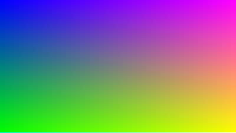

# raytracer-chiquito
Un raytracer hecho en c++, es un proyecto para aprender como funcionan los algoritmos que se usan para hacer raytracing, probablemente no sea tan eficiente **usar bajo su propio riesgo**.
Ahora con soporte a PNG, se elimino el soporte a ppm, luego volvera a implementarse con una interfaz. 
## Compilación
Testeado unicamente en linux  
`cmake -S . -B build/ && cmake --build build/ && build/RRIOW imagen.png`   
## Imagenes
|Gradiente de muchos colores|Gradiente con lerp de blanco a celeste|
|-------------------|--------------------|
|||
## TODO
 - [x] Implementar STB_IMAGES para poder exportar en PNG [^1]
 - [ ] Implementar poder colocar esferas y otras cosas.
 - [ ] Implementar una interface para poder decidir que imagen te exporta.
## Bibliografia
[Raytracing in one weekend](https://raytracing.github.io/books/RayTracingInOneWeekend.html#outputanimage)  
[^1]: [STB_IMAGES](https://github.com/nothings/stb#stb_libs)

